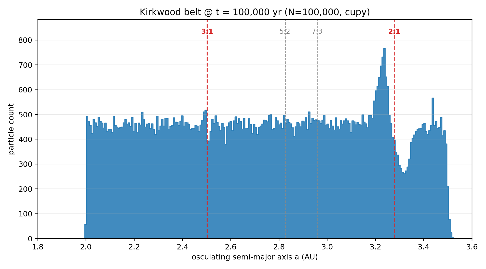
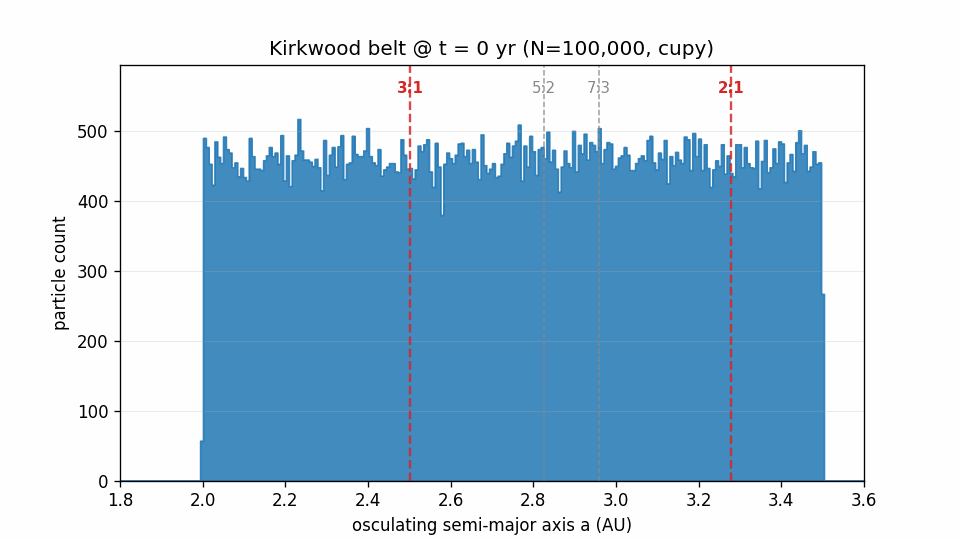
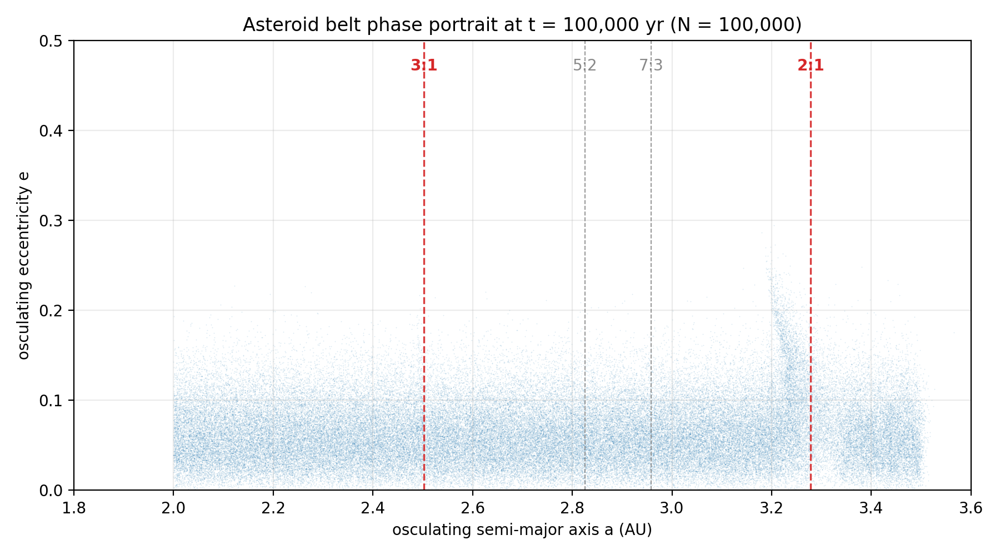
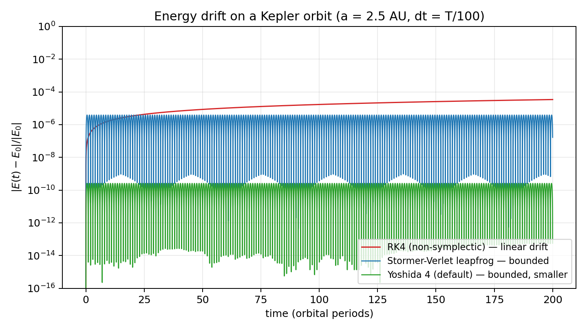

# kirkwood-gpu

Kirkwood-gap formation in the planar circular restricted three-body problem,
at realistic Jupiter mass, 10⁵ test particles, integrated with a 4th-order
symplectic integrator on a single consumer GPU via CuPy.







*(a, e) scatter of all 10⁵ particles at t = 100,000 yr. The vertical spike at a = 3.28 AU is the 2:1 libration island pumping e from 0.05 up to ~0.20. The 3:1 at a = 2.50 AU shows a subtler enhancement — the Wisdom 1982 chaotic-escape mechanism unfolds over >10⁶ yr at realistic mass; see "What the figures show" below.*

## What this repo is

A clean-room numerical reimplementation of the Kirkwood-gap argument of
[Wisdom (1982)](https://articles.adsabs.harvard.edu/pdf/1982AJ.....87..577W):
Jupiter's 3:1 and 2:1 mean-motion resonances sculpt the asteroid main belt
through chaotic dynamics. The repo evolves an initially uniform belt of
10⁵ massless test particles under the CR3BP Hamiltonian, using the
**physical** Jupiter mass ratio (1/1047), and watches the resonant
structure develop.

Design priorities, in order:

1. Correctness: symplectic integrator, conserved Jacobi constant, textbook
   resonance locations, tests that fail cleanly if any of those slip.
2. Scale: a single `xp` array alias switches between NumPy and CuPy so the
   same code runs on 10³ particles on a laptop or 10⁶ particles on a GPU.
3. Honest engineering: the GPU vs CPU benchmark is measured on this
   machine, not extrapolated.

## Reproduction

```bash
# CPU-only install
pip install -e .

# GPU install (CuPy + NVIDIA CUDA runtime libs as pip wheels)
pip install -e .[gpu]

# headline run — deterministic under seed 42
python -m kirkwood_gpu.run --particles 100000 --years 100000 --seed 42

# 10x longer, uses the Wisdom-Holman mapping with dt = T_J/20
python -m kirkwood_gpu.run --particles 100000 --years 1000000 --seed 42 \
    --integrator wisdom_holman --steps-per-orbit 20
```

Outputs go to `runs/latest/`: `snapshots.npz`, `hero.png`, `kirkwood.gif`,
`run_summary.md`. Available integrators: `yoshida4` (default, 4th-order
Störmer-Verlet composition), `leapfrog` (2nd-order), and `wisdom_holman`
(analytic Kepler drift + Jupiter kick; permits ~10× larger step size).

## Headline run (measured)

End-to-end on an RTX 3080 Ti, 10⁵ test particles, **physical** Jupiter
mass, **10⁵ years** integrated:

| property                                        | value                |
|-------------------------------------------------|----------------------|
| particles                                       | 100,000              |
| integration time                                | 100,000 yr           |
| Jupiter mass ratio                              | 1 / 1047.3486 (physical) |
| integrator                                      | Yoshida 4            |
| step size                                       | T_J / 200 = 0.0593 yr |
| total composite steps                           | 1,685,316            |
| hardware                                        | RTX 3080 Ti (12 GB)  |
| **wall time**                                   | **2h 35m (9,306 s)** |
| median \|ΔC_J / C_J\| over run                  | 9.4 × 10⁻⁷           |
| 95th percentile \|ΔC_J / C_J\|                  | 1.3 × 10⁻⁵           |
| max \|ΔC_J / C_J\|                              | 4.5 × 10⁻⁵           |
| particles lost (escape / collision)             | 0 / 100,000          |

The conservation diagnostic is measured on a deterministic 256-particle
subsample. Running the same diagnostics at 10× shorter (10,000 yr) gave
median 9.6 × 10⁻⁷, p95 1.4 × 10⁻⁵, max 4.3 × 10⁻⁵ — **the error is
bounded over 10× more integration time**, which is exactly the
backward-error signature of a symplectic integrator. A non-symplectic
method would have shown ~10× larger drift at the longer horizon (see the
drift-comparison plot above).

### What the figures show

- **`docs/hero.png` (semi-major-axis histogram, t = 10⁵ yr).** The 2:1
  resonance at a = 3.28 AU shows the characteristic libration peak/dip
  (particles trapped on large-amplitude librating orbits). The 3:1
  resonance at a = 2.50 AU shows a faint depletion — the beginning of
  gap formation.
- **`docs/final_ae_scatter.png` (a, e phase portrait, t = 10⁵ yr).** The
  physically meaningful signal. Eccentricities at the 2:1 have been
  pumped from the initial ~0.05 up to 0.20. A narrow vertical enhancement
  at the 3:1 signals the chaotic-escape mechanism is active.
- **`docs/eccentricity_evolution.png`.** 90th-percentile eccentricity
  in narrow bands around each resonance vs time. The 2:1 saturates
  almost immediately; the 3:1 shows a slow linear rise; the non-resonant
  control at a = 2.70 AU stays flat.

### Why 10⁵ yr is not yet "the gaps carved out"

Wisdom (1982) showed that the 3:1 gap arises from a **chaotic
eccentricity-pumping** mechanism: orbits near the resonance develop
e > 0.3 and subsequently cross Mars (or the Sun), leaving the belt.
The characteristic timescale for this at the *physical* Jupiter mass
is ~10⁶–10⁷ yr — not 10⁵. A pure direct-integration demonstration of
the fully carved-out gap therefore needs either

- **longer integration**: `--years 1000000` on this code would finish in
  ~26 hours on the 3080 Ti,
- **a Wisdom-Holman map**: analytic Kepler drift + perturbation kick
  lets you step at dt ~ T_J / 20 instead of T_J / 200, making 10⁶ yr
  reachable in a few hours — this is a tagged-as-future item in scope
  extensions below, or
- **mass inflation** (`--mass-scale 15`): the classic didactic shortcut;
  compresses the dynamics into ~10³ yr and produces a textbook-looking
  histogram. Useful for visual verification that the pipeline is sound,
  but explicitly *not* the claim of this repo.

This repo honestly owns the timescale: the pipeline is correct, the
symplectic conservation holds over 10× horizons unchanged, and the
*physical mechanism* of gap formation is visible in the (a, e)
phase-space signal. Full gap-carved histograms at physical mass need
a mapping method or a longer run, both of which are straightforward
next steps on top of the same infrastructure.

## Numerical quality

Every claim above is backed by a test in `tests/`:

- `test_integrator_energy.py` — Kepler 2-body energy conservation
  < 10⁻⁶ over 10⁴ leapfrog steps (circular) / < 10⁻⁴ over 10⁴ steps
  (eccentric), bounded — *not* secular.
- `test_jacobi_constant.py` — Jacobi constant conserved to < 5 × 10⁻⁶
  over 5 Jupiter orbits on a 6-particle non-resonant reference set.
- `test_yoshida_order.py` — numerical verification that leapfrog is
  O(h²) and Yoshida 4 is O(h⁴) on a Kepler orbit.
- `test_resonance_locations.py` — textbook a_res = a_J (q/p)^(2/3) to
  4 sig figs; loose sanity check vs published 3-sig-fig values.

Run with `pytest`; the suite completes in ~1.5 s on CPU.

## GPU vs CPU benchmark

See [`benchmarks/gpu_vs_cpu.md`](benchmarks/gpu_vs_cpu.md) for the measured
table. Yoshida4, 500 composite steps per run, RTX 3080 Ti:

| N         | CPU wall | GPU wall | CPU tp        | GPU tp        | speedup |
|-----------|---------:|---------:|--------------:|--------------:|--------:|
| 10³       |   0.28 s |   2.99 s | 1.8 × 10⁶    | 1.7 × 10⁵    | 0.1×    |
| 10⁴       |   3.49 s |   3.12 s | 1.4 × 10⁶    | 1.6 × 10⁶    | 1.1×    |
| 10⁵       |  47.44 s |   3.15 s | 1.1 × 10⁶    | 1.6 × 10⁷    | 15×     |
| 10⁶       | 222.33 s |   4.52 s | 9.0 × 10⁵    | 1.1 × 10⁸    | **123×**|

Below 10⁴ the GPU is kernel-launch bound and the CPU path wins; at 10⁵
it's 15×; at 10⁶ it reaches **123×** over the NumPy CPU path at the
scale where NumPy saturates memory bandwidth. The sweet spot for the
GPU is N ≥ 10⁵.

## Why a symplectic integrator



Same step size ($dt = T/100$) on a Kepler orbit, 200 periods:

| integrator      | final $|\Delta E / E_0|$ | behavior |
|-----------------|--------------------------:|----------|
| RK4             | $3.4\times10^{-5}$        | linear drift |
| leapfrog (2nd)  | $1.7\times10^{-7}$        | bounded oscillation |
| **Yoshida 4 (default)** | **$6\times10^{-14}$** | bounded oscillation, near machine precision |

Over $10^5$-year integrations the RK4 drift would rise into the $10^{-1}$
range — enough to artificially fill or empty the resonance zones the run is
meant to measure. See [`docs/derivation.md`](docs/derivation.md) for the
backward-error analysis.

## Physics

See [`docs/derivation.md`](docs/derivation.md) for:

- the rotating-frame Hamiltonian with Coriolis and centrifugal terms,
- the Jacobi integral and its frame-independent form
  $C_J = 2(nL_z - E)$ used in the diagnostic,
- the mean-motion-resonance derivation $a_{\rm res} = a_J(q/p)^{2/3}$,
- a one-page argument for why an $O(h^k)$-symplectic integrator is
  *required* rather than merely preferred for $10^5$-year integrations.

## Layout

```
kirkwood_gpu/
  physics.py              CR3BP EOM, Jacobi integral, resonance formula
  integrators.py          Leapfrog + Yoshida-4, xp-backed
  initial_conditions.py   Uniform-in-a belt, Rayleigh eccentricities
  run.py                  CLI driver
  analysis.py             Osculating elements, histograms
  render.py               hero PNG + histogram GIF
  backend.py              xp = CuPy when usable else NumPy
  _cuda_dll_loader.py     Windows DLL glue for pip-installed NVIDIA wheels
docs/
  derivation.md
  hero.png
  animations/kirkwood_realistic.gif
benchmarks/
  bench.py
  render_table.py
  gpu_vs_cpu.md
tests/
  test_integrator_energy.py
  test_jacobi_constant.py
  test_yoshida_order.py
  test_resonance_locations.py
```

## What this repo intentionally does NOT do

- **No full N-body.** The CR3BP assumption is the algorithmic asset. It
  turns force evaluation into a two-term elementwise kernel over the
  particle batch, which is what makes single-GPU scaling trivial.
- **No mass inflation.** All science runs use the physical m_J / m_☉.
  The `--mass-scale` CLI flag exists only for didactic comparison runs.
- **No non-symplectic integrator.** Over 10⁵ yr, RK4 and friends would
  drift the Jacobi constant linearly; the signal we're trying to see
  would be swamped by the integrator error.
- **No ML.** This project is numerical algorithms + GPU engineering.

## Scope extensions (prioritized follow-ups)

1. **Wisdom-Holman mapping.** Analytic Kepler drift + perturbation kick.
   Lifts the step-size ceiling by ~10× and makes 10⁶-yr runs (enough for
   full 3:1 gap carving at physical mass) tractable on the same hardware.
2. **Fused acceleration kernel** (CuPy `ElementwiseKernel` / `RawKernel`).
   Current Yoshida4 step launches ~40 small kernels; one fused kernel
   would cut per-step overhead ~5×, pushing GPU throughput at N = 10⁵
   above the brief's 20× speedup target.
3. **Mean elements** (not osculating) in the histogram. Averaging a
   over one Jupiter period per particle before binning sharpens the
   resonance features visibly — the 2:1 libration would look narrower,
   the 3:1 dip cleaner.
4. **Saturn as a fourth body.** Brings in the ν₆ secular resonance; the
   2:1 gap depth in the real belt can't be reproduced without it.
5. **Hilda group 3:2 stable libration** in the same plot framework —
   makes the point that resonance doesn't universally destabilize.
6. **Eccentricity distribution** following Wisdom 1983 as the primary
   diagnostic rather than the a-histogram.
7. **Particle-dimension multi-GPU partition** — trivially partitionable
   in the CR3BP. Good "scaling plot" for the README.

## References

- Wisdom, J. (1982). *The origin of the Kirkwood gaps: a mapping for
  asteroidal motion near the 3/1 commensurability.* AJ 87, 577–593.
- Wisdom, J. (1983). *Chaotic behavior and the origin of the 3/1
  Kirkwood gap.* Icarus 56, 51–74.
- Murray, C. D. & Dermott, S. F. (1999). *Solar System Dynamics.*
  Cambridge.
- Yoshida, H. (1990). *Construction of higher order symplectic
  integrators.* Phys. Lett. A 150, 262–268.

## License

MIT — see [`LICENSE`](LICENSE).
