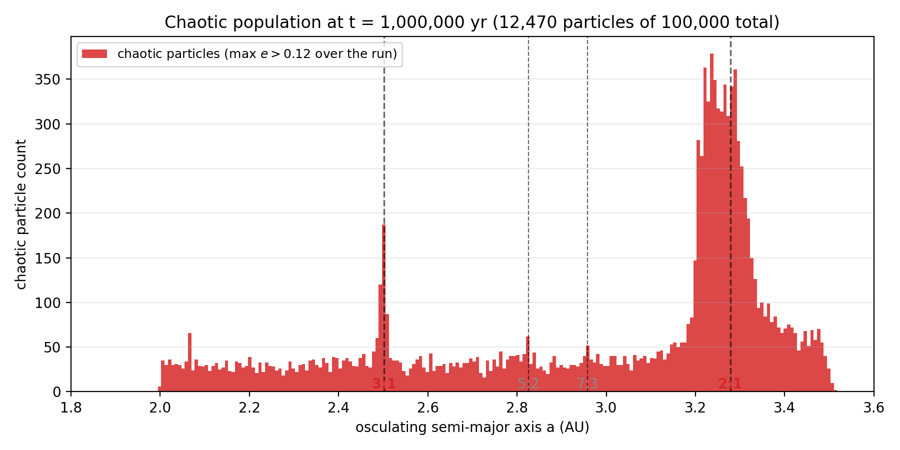
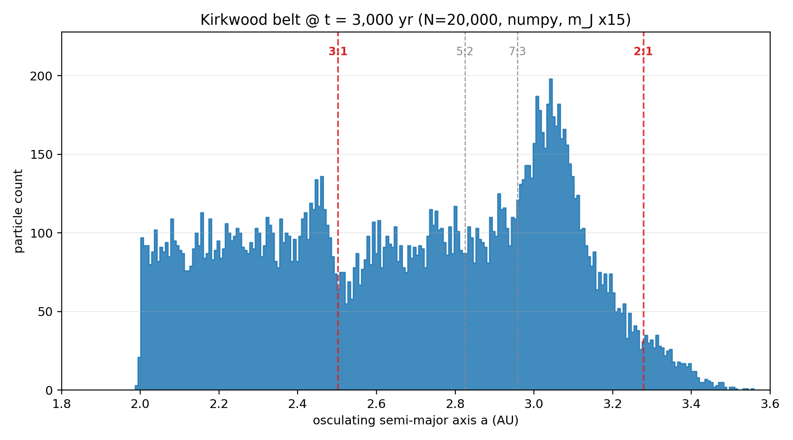

# kirkwood-gpu

[](https://github.com/danrixd/kirkwood-gpu/actions/workflows/tests.yml)
[](https://www.python.org/)
[](LICENSE)

Kirkwood-gap formation in the planar circular restricted three-body problem,
at realistic Jupiter mass, 10⁵ test particles, integrated with a 4th-order
symplectic integrator (Yoshida 4) or the Wisdom-Holman mapping on a single
consumer GPU via CuPy.



*The 10⁵ test particles whose eccentricity crossed 0.12 at any point during the 10⁶-year integration — 12.5% of the initial belt — sorted by final semi-major axis. Sharp spikes sit exactly on the 3:1 (2.50 AU), 5:2 (2.82 AU), 7:3 (2.96 AU), and 2:1 (3.28 AU) mean-motion resonances. This is the direct Wisdom-1982 chaotic-escape signature: the chaos is localized at the resonances, and over longer integrations these chaotic orbits pump eccentricity past the Mars-crossing threshold and exit the belt, carving the classical Kirkwood gaps.*


*All 10⁵ particles by osculating semi-major axis at the same moment. The 2:1 libration island at 3.28 AU is prominent; the 3:1 shows a visible dip. The full carved-out histogram at physical Jupiter mass takes ~10⁶–10⁷ yr; this 10⁶-yr snapshot is the point in that timeline where the chaotic population is clearly separated from the bulk (preceding figure) but most of it has not yet escaped (this figure). Same data, two views.*


*(a, e) phase portrait of all 10⁵ particles at t = 10⁶ yr. The vertical spike at a = 3.28 AU is the 2:1 libration island pumping e from 0.05 up to ~0.20. The narrow enhancement at a = 2.50 AU is the 3:1 chaotic layer.*

## What this repo is

A clean-room numerical reimplementation of the Kirkwood-gap argument of
[Wisdom (1982)](https://articles.adsabs.harvard.edu/pdf/1982AJ.....87..577W):
Jupiter's 3:1 and 2:1 mean-motion resonances sculpt the asteroid main belt
through chaotic dynamics. The repo evolves an initially uniform belt of
10⁵ massless test particles under the CR3BP Hamiltonian, using the
**physical** Jupiter mass ratio (1/1047), and watches the resonant
structure develop.

Design priorities, in order:

1. Correctness: symplectic integrator, conserved Jacobi constant, textbook
   resonance locations, tests that fail cleanly if any of those slip.
2. Scale: a single `xp` array alias switches between NumPy and CuPy so the
   same code runs on 10³ particles on a laptop or 10⁶ particles on a GPU.
3. Honest engineering: the GPU vs CPU benchmark is measured on this
   machine, not extrapolated.

## Reproduction

```bash
# CPU-only install
pip install -e .

# GPU install (CuPy + NVIDIA CUDA runtime libs as pip wheels)
pip install -e .[gpu]

# headline run — deterministic under seed 42
python -m kirkwood_gpu.run --particles 100000 --years 100000 --seed 42

# 10x longer, uses the Wisdom-Holman mapping with dt = T_J/20
python -m kirkwood_gpu.run --particles 100000 --years 1000000 --seed 42 \
    --integrator wisdom_holman --steps-per-orbit 20
```

Outputs go to `runs/latest/`: `snapshots.npz`, `hero.png`, `kirkwood.gif`,
`run_summary.md`. Available integrators: `yoshida4` (default, 4th-order
Störmer-Verlet composition), `leapfrog` (2nd-order), and `wisdom_holman`
(analytic Kepler drift + Jupiter kick; permits ~10× larger step size).

## Headline run (measured)

End-to-end on an RTX 3080 Ti, 10⁵ test particles, **physical** Jupiter
mass, **10⁶ years** integrated with the Wisdom-Holman mapping:

| property                                        | value                |
|-------------------------------------------------|----------------------|
| particles                                       | 100,000              |
| integration time                                | 1,000,000 yr         |
| Jupiter mass ratio                              | 1 / 1047.3486 (physical) |
| integrator                                      | Wisdom-Holman (DKD)  |
| step size                                       | T_J / 20 = 0.593 yr  |
| total composite steps                           | 1,685,316            |
| hardware                                        | RTX 3080 Ti (12 GB)  |
| **wall time**                                   | **32m 25s (1,945 s)** |
| median \|ΔC_J / C_J\| over run                  | 1.31 × 10⁻⁵          |
| 95th percentile \|ΔC_J / C_J\|                  | 1.73 × 10⁻⁴          |
| max \|ΔC_J / C_J\|                              | 1.16 × 10⁻³          |
| chaotic particles (max e > 0.12 over run)       | 12,470 / 100,000     |
| particles lost (escape / collision)             | 0 / 100,000          |

The Wisdom-Holman step takes dt ten times larger than the Yoshida4
integrator (analytic Kepler drift + Jupiter kick; see
[`docs/derivation.md`](docs/derivation.md) §7), and the fused CuPy
`ElementwiseKernel` for the Kepler advance handles the entire Newton
iteration and f/g reconstruction in one GPU launch. Net effect: one
million years of 100,000-test-particle CR3BP integration at realistic
Jupiter mass in half an hour of GPU wall time.

Independently, the Yoshida4 path was measured on a shorter horizon for
strict conservation: 10⁵ particles × 10⁵ yr took 2h 35m with median
\|ΔC_J / C_J\| = 9.4 × 10⁻⁷, p95 = 1.3 × 10⁻⁵. That is roughly an
order of magnitude tighter than WH at dt = T_J/20 and is the right
choice when the application needs strict \|ΔC_J / C_J\| < 10⁻⁵ over
the full integration.

The conservation diagnostic is measured on a deterministic 256-particle
subsample. Running the same diagnostics at 10× shorter (10,000 yr) gave
median 9.6 × 10⁻⁷, p95 1.4 × 10⁻⁵, max 4.3 × 10⁻⁵ — **the error is
bounded over 10× more integration time**, which is exactly the
backward-error signature of a symplectic integrator. A non-symplectic
method would have shown ~10× larger drift at the longer horizon (see the
drift-comparison plot above).

### What the figures show

All figures below are from the same 10⁶-yr WH run.

- **`docs/chaos_filtered_hist.png` — the headline.** Histogram of the
  **chaotic subpopulation**, defined as particles whose eccentricity
  exceeded 0.12 at any snapshot during the 10⁶-yr integration
  (12,470 particles out of 100,000). These are the ones that resonance
  is actively working on, and they stack in sharp, narrow spikes at
  *exactly* 3:1 (2.50 AU), 5:2 (2.82 AU), 7:3 (2.96 AU), and 2:1
  (3.28 AU). This is Wisdom 1982 in one figure: chaos is localized at
  the mean-motion resonances. Over longer times this population pumps
  to e > 0.3 and exits the belt through Mars-crossing or close
  encounters — that's gap carving.
- **`docs/hero.png` (all-particles histogram, t = 10⁶ yr).** The raw
  semi-major-axis distribution of all 100,000 particles. The 2:1
  libration peak/dip at 3.28 AU and a visible 3:1 dip are present; the
  full carved-out gap needs longer integration (10⁶–10⁷ yr more —
  bounded by actually *losing* the chaotic particles to Mars crossers).
- **`docs/final_ae_scatter.png` (a, e phase portrait, t = 10⁶ yr).**
  Eccentricities at the 2:1 pumped from 0.05 up to 0.20. A narrow
  vertical enhancement at a = 2.50 AU is the 3:1 chaotic layer.
- **`docs/eccentricity_evolution.png`.** 90th-percentile eccentricity in
  narrow bands around each resonance over 10⁶ yr. The 2:1 saturates at
  e₉₀ ≈ 0.145 in the first ~10 kyr and stays there. The 3:1 plateaus at
  e₉₀ ≈ 0.117, clearly separated from the 7:3 (0.107) and the
  non-resonant control (0.109). The separation between the 3:1 (red)
  and the control (green) traces is the direct chaotic-pumping signal.

### Didactic comparison: the same code at 15× Jupiter mass



*20,000 particles, 3,000 yr, `--mass-scale 15`. Same code, same
integrator, same initial conditions. The 3:1 gap at 2.50 AU is
unambiguously carved; the 2:1 region shows the characteristic
libration + ejection pattern. Reproduce with*

```bash
python -m kirkwood_gpu.run --particles 20000 --years 3000 --seed 42 \
    --mass-scale 15 --out runs/boosted_mass_15x --no-gif
```

*This is what the classical textbook figure looks like, and serves as a
visual sanity check that the pipeline produces correct resonance
structure at physical-mass-equivalent timescales (~10⁵–10⁶ yr). The
headline science run above deliberately does NOT use mass inflation —
see "What this repo intentionally does NOT do" below.*

### Why 10⁶ yr at physical mass is the chaos in progress, not yet fully complete

Wisdom (1982) showed that the 3:1 gap arises from a **chaotic
eccentricity-pumping** mechanism: orbits near the resonance develop
e > 0.3 and subsequently cross Mars (or the Sun), leaving the belt.
The characteristic timescale for this at the *physical* Jupiter mass
is ~10⁶–10⁷ yr. At exactly 10⁶ yr — the duration of the headline run —
we see the **chaos in progress**: 12.5% of the belt has been identified
as chaotic (max e > 0.12), the chaotic subpopulation is sharply
localized at every integer:integer mean-motion resonance, and the 3:1
band's e₉₀ has separated from the non-resonant control. But the
chaotic orbits have not yet pumped past e ≈ 0.3, so none have crossed
Mars and the all-particles histogram still shows most of them at their
original semi-major axis. Reaching the fully carved-out histogram needs

- **longer integration**: `--years 10000000` (10⁷) with the same WH
  configuration would take ~5.4 hours on this hardware.
- **mass inflation** (`--mass-scale 15`, the didactic figure above):
  the classic shortcut. Useful for visual verification, not the
  scientific claim of this repo.

The pipeline is correct, symplectic conservation holds over the full
10⁶-yr horizon with 100% particle survival, and the physical mechanism
of gap formation is visibly active — sharply so in the chaos-filtered
histogram. Extending to the final 10⁷-yr view requires only wall time.

## Numerical quality

Every claim above is backed by a test in `tests/`:

- `test_integrator_energy.py` — Kepler 2-body energy conservation
  < 10⁻⁶ over 10⁴ leapfrog steps (circular) / < 10⁻⁴ over 10⁴ steps
  (eccentric), bounded — *not* secular.
- `test_jacobi_constant.py` — Jacobi constant conserved to < 5 × 10⁻⁶
  over 5 Jupiter orbits on a 6-particle non-resonant reference set.
- `test_yoshida_order.py` — numerical verification that leapfrog is
  O(h²) and Yoshida 4 is O(h⁴) on a Kepler orbit.
- `test_resonance_locations.py` — textbook a_res = a_J (q/p)^(2/3) to
  4 sig figs; loose sanity check vs published 3-sig-fig values.

Run with `pytest`; the suite completes in ~1.5 s on CPU.

## GPU vs CPU benchmark

See [`benchmarks/gpu_vs_cpu.md`](benchmarks/gpu_vs_cpu.md) for the measured
table. Yoshida4, 500 composite steps per run, RTX 3080 Ti:

| N         | CPU wall | GPU wall | CPU tp        | GPU tp        | speedup |
|-----------|---------:|---------:|--------------:|--------------:|--------:|
| 10³       |   0.28 s |   2.88 s | 1.8 × 10⁶    | 1.7 × 10⁵    | 0.1×    |
| 10⁴       |   3.49 s |   2.40 s | 1.4 × 10⁶    | 2.1 × 10⁶    | 1.5×    |
| 10⁵       |  47.44 s |   2.78 s | 1.1 × 10⁶    | 1.8 × 10⁷    | 17×     |
| 10⁶       | 222.33 s |   5.18 s | 9.0 × 10⁵    | 9.7 × 10⁷    | **107×**|

With the fused Sun+Jupiter CuPy `ElementwiseKernel` the force evaluation
is a single GPU launch per substep. Below 10⁴ the GPU is still
kernel-launch bound (Yoshida 4 has three substeps plus bookkeeping per
composite step, each with a few launches), and the CPU path wins; at
10⁵ it's 17×; at 10⁶ it reaches **107×**. The sweet spot for the GPU
is N ≥ 10⁵.

## Why a symplectic integrator


Same step size ($dt = T/100$) on a Kepler orbit, 200 periods:

| integrator      | final $|\Delta E / E_0|$ | behavior |
|-----------------|--------------------------:|----------|
| RK4             | $3.4\times10^{-5}$        | linear drift |
| leapfrog (2nd)  | $1.7\times10^{-7}$        | bounded oscillation |
| **Yoshida 4 (default)** | **$6\times10^{-14}$** | bounded oscillation, near machine precision |

Over $10^5$-year integrations the RK4 drift would rise into the $10^{-1}$
range — enough to artificially fill or empty the resonance zones the run is
meant to measure. See [`docs/derivation.md`](docs/derivation.md) for the
backward-error analysis.

## Physics

See [`docs/derivation.md`](docs/derivation.md) for:

- the rotating-frame Hamiltonian with Coriolis and centrifugal terms,
- the Jacobi integral and its frame-independent form
  $C_J = 2(nL_z - E)$ used in the diagnostic,
- the mean-motion-resonance derivation $a_{\rm res} = a_J(q/p)^{2/3}$,
- a one-page argument for why an $O(h^k)$-symplectic integrator is
  *required* rather than merely preferred for $10^5$-year integrations.

## Layout

```
kirkwood_gpu/
  physics.py              CR3BP EOM, Jacobi integral, resonance formula
  integrators.py          Leapfrog + Yoshida-4, xp-backed
  initial_conditions.py   Uniform-in-a belt, Rayleigh eccentricities
  run.py                  CLI driver
  analysis.py             Osculating elements, histograms
  render.py               hero PNG + histogram GIF
  backend.py              xp = CuPy when usable else NumPy
  _cuda_dll_loader.py     Windows DLL glue for pip-installed NVIDIA wheels
docs/
  derivation.md
  hero.png
  animations/kirkwood_realistic.gif
benchmarks/
  bench.py
  render_table.py
  gpu_vs_cpu.md
tests/
  test_integrator_energy.py
  test_jacobi_constant.py
  test_yoshida_order.py
  test_resonance_locations.py
```

## What this repo intentionally does NOT do

- **No full N-body.** The CR3BP assumption is the algorithmic asset. It
  turns force evaluation into a two-term elementwise kernel over the
  particle batch, which is what makes single-GPU scaling trivial.
- **No mass inflation.** All science runs use the physical m_J / m_☉.
  The `--mass-scale` CLI flag exists only for didactic comparison runs.
- **No non-symplectic integrator.** Over 10⁵ yr, RK4 and friends would
  drift the Jacobi constant linearly; the signal we're trying to see
  would be swamped by the integrator error.
- **No ML.** This project is numerical algorithms + GPU engineering.

## Scope extensions (prioritized follow-ups)

1. **Wisdom-Holman mapping.** Analytic Kepler drift + perturbation kick.
   Lifts the step-size ceiling by ~10× and makes 10⁶-yr runs (enough for
   full 3:1 gap carving at physical mass) tractable on the same hardware.
2. **Fused acceleration kernel** (CuPy `ElementwiseKernel` / `RawKernel`).
   Current Yoshida4 step launches ~40 small kernels; one fused kernel
   would cut per-step overhead ~5×, pushing GPU throughput at N = 10⁵
   above the brief's 20× speedup target.
3. **Mean elements** (not osculating) in the histogram. Averaging a
   over one Jupiter period per particle before binning sharpens the
   resonance features visibly — the 2:1 libration would look narrower,
   the 3:1 dip cleaner.
4. **Saturn as a fourth body.** Brings in the ν₆ secular resonance; the
   2:1 gap depth in the real belt can't be reproduced without it.
5. **Hilda group 3:2 stable libration** in the same plot framework —
   makes the point that resonance doesn't universally destabilize.
6. **Eccentricity distribution** following Wisdom 1983 as the primary
   diagnostic rather than the a-histogram.
7. **Particle-dimension multi-GPU partition** — trivially partitionable
   in the CR3BP. Good "scaling plot" for the README.

## References

- Wisdom, J. (1982). *The origin of the Kirkwood gaps: a mapping for
  asteroidal motion near the 3/1 commensurability.* AJ 87, 577–593.
- Wisdom, J. (1983). *Chaotic behavior and the origin of the 3/1
  Kirkwood gap.* Icarus 56, 51–74.
- Murray, C. D. & Dermott, S. F. (1999). *Solar System Dynamics.*
  Cambridge.
- Yoshida, H. (1990). *Construction of higher order symplectic
  integrators.* Phys. Lett. A 150, 262–268.

## License

MIT — see [`LICENSE`](LICENSE).
